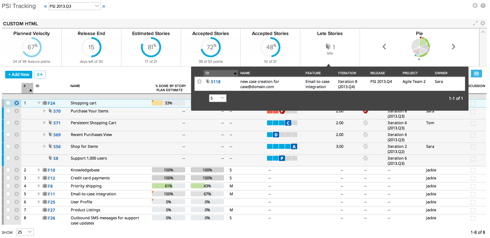

PSITrackingApp
==============

The PSI Tracking App is a varient of the new Iteration Status Page in Rally. This app shows the Features for a specified release and allows you to drilldown to the Stories, Defects, Tasks, ect. that roll up to the Feature.

It also give dashboard metrics for tracking the progress of the PSI / Release. The metrics are:
* Planned vs. Committed Velocity
* Release Days Left
* Percent of Stories with a Planned Estimate set
* Accepted Stories by Plan Esimate
* Accepted Stories by Count
* Late Stories (including a popover to see which Stories have been planned late)
* Pie Chart for Features to Stories progress

Screenshot
==========

